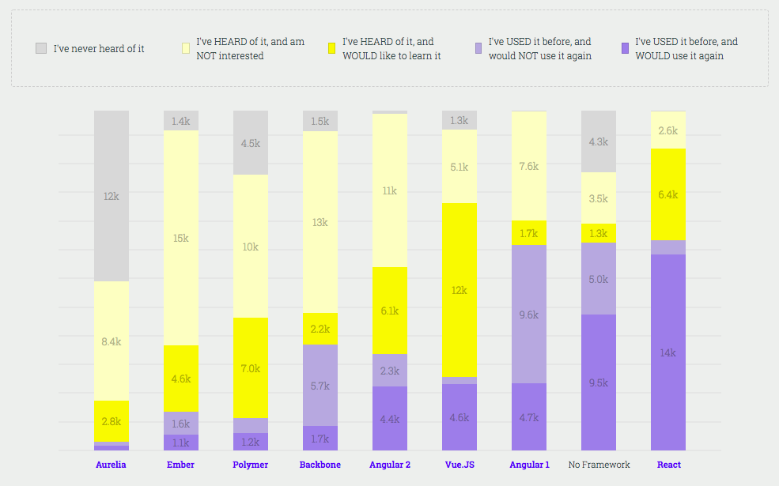

# NTUOSS React Workshop

_by [Lakshyajeet Dwivedee](https://laksh22.github.io) for [NTU Open Source Society](https://github.com/ntuoss)_

This workshop features a brief primer on HTML, CSS, and Javascript, followed by a walkthrough of the basics of React taught by making a clone of [INSERT WEBSITE NAME LATER]. Knowledge of basic programming concepts is useful but not required for this workshop.

**Disclaimer:** _This document is only meant to serve as a reference to the attendees of the workshop. Please check out the [official documentation](https://reactjs.org/docs/getting-started.html) for a full, comprehensive understanding of React._

---

[INSERT BANNER ART]

_Artwork by [@hyde-brendan](https://github.com/hyde-brendan)_

### Workshop Details

**When:** Friday, 24 January 2020. 6:30PM - 8:30PM  
**Where:** LT1, Nanyang Technological University  
**Who:** NTU Open Source Society

### Questions

Please raise your hand any time during the workshop.

### Errors

For errors, typos or suggestions, please do not hesitate to [post an issue](https://github.com/laksh22/NTUOSS-ReactWorkshop/issues/new)! Pull requests are very welcome, thank you!

---

## Index

1. [Introduction](#intro)
2. [A Web Dev Analogy](#analogy)
3. [What are frameworks](#frameworks)
4. [React: The framework that's actually a library](#whats-react)

---

<a id="intro"></a>

## 1. Introduction

This workshop is mainly concerned with learning the basics of React but since HTML, CSS and JS are important prerequisites, we will first go through a brief overview of them. After that, we will learn about React and see how it can make web development a lot easier.

<a id="analogy"></a>

## 2. A Web Dev Analogy


You can think of web development like building a house.

### 2.1 HTML

HTML can be though of as the bricks. It is used to present content in a structured manner to the viewer, much like how bricks are used to provide structure to a house.

HTML is made up of special tags which contain information on how to represent the content inside them. We can see this with the following example

```
<!DOCTYPE html>
<html lang="en">
  <head>
    <meta charset="UTF-8" />
    <title>Document</title>
  </head>
  <body>
    <div class="grey-background-section">
      <h1>This is a heading</h1>
      <p>This is a paragraph</p>
    </div>
  </body>
</html>
```

You can ignore all the boilerplate code for now. The above code snippet shows a `div` element. A div is any unique section on the web page. Inside is `h1` tag which represents a heading, and `p` represents a paragraph . If you save the above code in a file called `index.html`, the result will be as follows:


There are numerous other tags such as `a` for links, `img` for images, and `button` for buttons.

### 2.2 CSS

A house is not very fun to live in if it's just bricks and doors. To make it liveable, we must paint it. Similarly, we use CSS to add decorations to make our website look more appealing.

Let's make our previous HTML look better. Make a folder called `css` and inside it make a file called `index.css`.

```
body {
  font-family: Arial, Helvetica, sans-serif;
  background-color: #f4f4f4;
}

.grey-background-section {
  background-color: #454545;
  border-radius: 18px;
  padding: 10px;
}

h1,
p {
  color: #aaaaaa;
}
```

We can use the name of the tag we want to change the appearance for and then specify the appearances we want changed. We can also use the class names which we had defined earlier in the HTML to change the view of that specific class.

We must link to this CSS somewhere in our HTML. To do this, we add the following lines of code between the `<head></head>` tags of our html:

```
<link rel="stylesheet" href="css/index.css" />
```

After all this, your webpage should look like this:


### 3. Javascript

Although it's nice to have a roof over our heads, a house would suck to live in if there was no plumbing and no electricity. Similarly, a website isn't very fun if all you can do with it is stare at it. Javascript let's us add some functionality to the website.

Let's make the heading change when we click on the `div`. We wil create a folder called `js` and in that, make a file called `index.js`. Add the following code into it:

```
const section = document.querySelector('.grey-background-section');

const heading = document.querySelector('#heading');

section.addEventListener('click', () => {
  console.log('CLICKED');
  heading.textContent = 'Clicked';
});
```

We first store the heading and `div` as variables and then say that whenever the div is clicked, the heading should change. We can include this file into our HTML **after** the `body` tag by adding the following code:

```
<script src="js/index.js"></script>
```

Now, whenever you click the `div`, this should be the output:


Congratulations, you just did DOM manipulation!

---

That is the end to our analogy and our brief overview of the basics of web development. Do note that this didn't even cover 1% of front-end development. Do learn more about each of these after the workshop. That being said, let's talk about JS frameworks.

<a id="frameworks"></a>

## 2. What are frameworks ????



The purpose of JavaScript frameworks is simple:

> Mapping application state to the DOM

What might not be clear from the previous section is that manipulating the DOM is very error prone, messy, and very hard to scale as the project gets bigger.

Frameworks such as React, Angular, or Vue help developers by making mistakes that could happen by direct DOM manipulation virtually impossible. If you want to understand this a bit more, here's some [further reading](https://medium.com/@mattburgess/javascript-frameworks-why-to-use-them-at-all-8cce2804c092).

Helpful side-effects of these frameworks is that they help reduce code, provide reusable elements, keep code structured and provide a vast array of helpful plug-ins and libraries made by other fans of the framework.

Simply put, using a framework will make it easier for you to make a website than simple JS DOM manipulation.

<a id="whats-react"></a>

## 3. React: The framework that's actually a library
